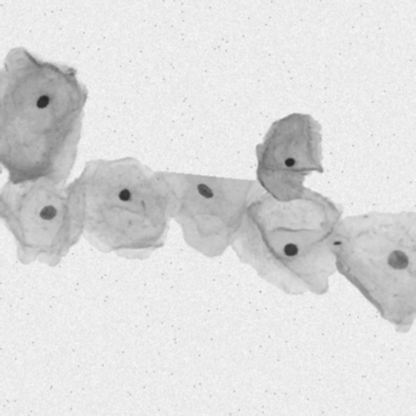
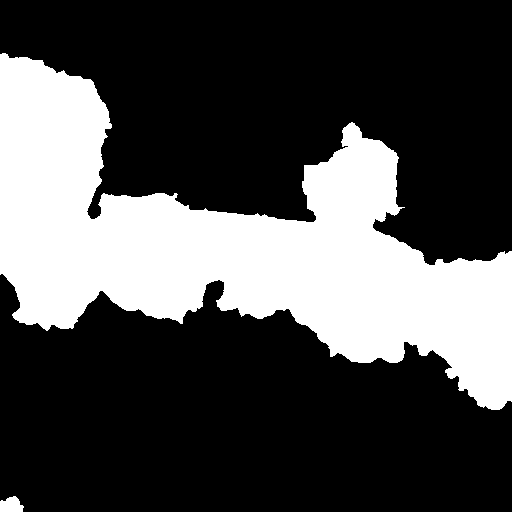
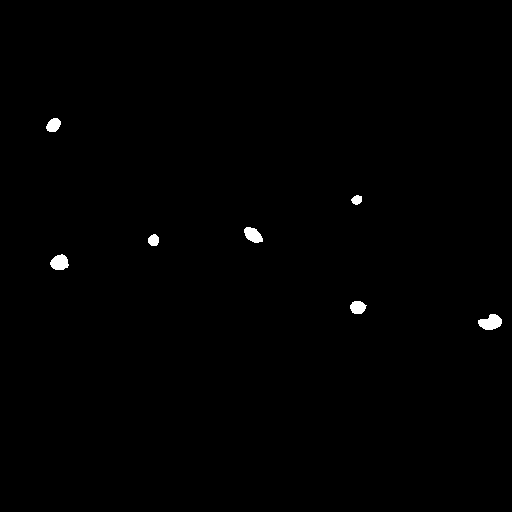
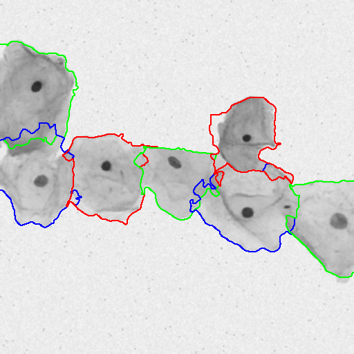

### Overlapping Cervical Cell Segmentation

#### Medical Image Processing Project
___

##### The paper aims to follow Dr. Lee and Dr. Kim’s [1] implementation on segmentation of cervical cells in microscopic images, and evaluate our algorithm on the dataset provided by the ISBI 2014 Challenge [2,3]. 

##### Please see attached Report for full details
###### Sample Results of Algorithm (*all results available in repo*)
Original Image             |  Cell Wall Detection             |  Nucleus Detection | Overlapping Cell Segmentation |
:-------------------------:|:-------------------------:|:-------------------------:|:-------------------------:|
 |  |  | 
___

###### [1]	H. Lee and J. Kim, "Segmentation of Overlapping Cervical Cells in Microscopic Images with Superpixel Partitioning and Cell-Wise Contour Refinement," 2016 IEEE Conference on Computer Vision and Pattern Recognition Workshops (CVPRW), Las Vegas, NV, 2016, pp. 1367-1373. doi: 10.1109/CVPRW.2016.172

###### [2]	Z. Lu, G. Carneiro, and A. Bradley. An improved joint optimization of multiple level set functions for the segmentation of overlapping cervical cells. Image Processing, IEEE Transactions on, 24(4):1261–1272, April 2015.

###### [3]	Z. Lu, G. Carneiro, A. Bradley, D. Ushizima, M. S. Nosrati, A. Bianchi, C. Carneiro, and G. Hamarneh. Evaluation of three algorithms for the segmentation of overlapping cervical cells. IEEE Journal of Biomedical and Health Informatics, PP(99):1–1, 2016.
